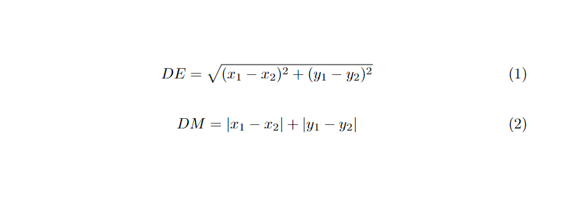

# Comparação dos métodos DFS, BFS, BFS-Euclidiano e BFS-Manhattan 

 
 

 

  Dois métodos comuns para resolver labirintos são o DFS, mais sobre ele <a href="https://github.com/Kingdrasill/labyrinth-dfs">https://github.com/Kingdrasill/labyrinth-dfs</a>, e o BFS, mais sobre ele <a href="https://github.com/Kingdrasill/labyrinth-bfs">https://github.com/Kingdrasill/labyrinth-bfs</a>. Os dois métodos resolvem um labirinto o que utilizaremos para medir qual é o melhor são os números de iterações de cada método, uma iteração é uma inserção na estrutura que a armazena o caminho percorrido. Tem como ainda melhorar o método BFS que é na hora que for andar escolher o caminho em que que a distância do final seja a menor, está distância por ser calculada por heuristíca euclidiana ou manhattan. A formúla do cálculo das mesma por ser visto na imagem a seguir:

  

# Labirinto BFS-Euclidiano

  Como dito antes o método do BFS pode ser melhorado usando heurísticas que adicionam uma regra o bf, está sendo que a posição da fila a ser verificada tem que ser a posição mais perto do final. Uma das heurísticas é a euclidiana ela faz com que o caminho do algoritmo tenda a ser mais diagonal até a saída. O calcúlo da distância, Fórmula 1, é feito na hora da inserção de uma posiçãona fila, para saber qual o item a fila tem a menor distância até a saída é feito um BubbleSort na fila para que a fila fica na ordem decrescente de ditância e para peguar a posição mais perta da saída eu só tenho que desinfileirar o primeiro elemento da fila para ter a posição de menor distância. 

# Labirinto BFS-Manhattan

  Outra heurística é a manhattan que faz com que o caminho do algoritmo tenda a ser primeiro vertical para baixo e depois horizontal para direita até a saída. O calcúlo da distância, Fórmula 2, é feito na hora da inserção de uma posiçãona fila, para saber qual o item a fila tem a menor distância até a saída é feito um BubbleSort na fila para que a fila fica na ordem decrescente de ditância e para peguar a posição mais perta da saída eu só tenho que desinfileirar o primeiro elemento da fila para ter a posição de menor distância. 

  O objetivo deste algoritmo é dar o usuário a escolha de qual método usar em labirinto, passdo pelo mesmo em um arquivo de texto, e o deixar ver a diferença dos números de iterações de cada método. Além de mostrar qual o melhor método por meio estátisco, os testes foram feitos com 30 labirintos 9x9 e 13x13 diferentes em que 10 foram em labirintos normais, 10 com mais bloqueios e 10 com menos bloqueios. Todos os labirintos de teste estão na pasta teste, embaixo de cada labirinto tem o número de iterações de cada metódo. 

> Observação: Em alguns labirintos o método do DFS não consegue terminar o labirinto, isto acontece por causa de como o método foi feito. O método não consegue andar para cima, então caminhos que é necessário andar para cima para terminar o labirinto o método não consegue proguedir mais e termina. Na pasta teste os labirintos em que o DFS não termina vai estar o número de iterações até para com um asterisco(X*).  
  
# Resultados Labirintos 9x9
  

<ul>
  <li>
    Labirinto normais 10, quantidade de vezes que cada método é o melhor:
    <ul>
      <li>DFS: 4, não terminou 1 vezes</li>
      <li>BFS: 0</li>
      <li>EUC: 3</li>
      <li>MAN: 1</li>
    </ul>
    Os métodos euclidiano e manhattan empataram 2 vezes como melhor método. 
  </li>
  <li>
    Labirinto com mais paredes 10, quantidade de vezes que cada método é o melhor:
    <ul>
      <li>DFS: 3, não terminou 5 vezes</li>
      <li>BFS: 0</li>
      <li>EUC: 2</li>
      <li>MAN: 3</li>
    </ul>
    Os métodos euclidiano e manhattan empataram 2 vezes como melhor método. 
  </li>
  <li>
   Labirinto com menos paredes 10, quantidade de vezes que cada método é o melhor:
    <ul>
      <li>DFS: 8</li>
      <li>BFS: 0</li>
      <li>EUC: 2</li>
      <li>MAN: 0</li>
    </ul>
  </li>
</ul>

  
# Resultados Labirintos 13x13

<ul>
  <li>
    Labirinto normais 10, quantidade de vezes que cada método é o melhor:
    <ul>
      <li>DFS: 2, não terminou 4 vezes</li>
      <li>BFS: 0</li>
      <li>EUC: 3</li>
      <li>MAN: 3</li>
    </ul>
    Os métodos euclidiano e manhattan empataram 2 vezes como melhor método. 
  </li>
  <li>
    Labirinto com mais paredes 10, quantidade de vezes que cada método é o melhor:
    <ul>
      <li>DFS: 2, não terminou 8 vezes</li>
      <li>BFS: 0</li>
      <li>EUC: 2</li>
      <li>MAN: 1</li>
    </ul>
    Os métodos euclidiano e manhattan empataram 4 vezes como melhor método.
    Os métodos bfs, bfs-euclidiano e bfs-manhattan empataram 1 vez como melhor método. 
  </li>
  <li>
   Labirinto com menos paredes 10, quantidade de vezes que cada método é o melhor:
    <ul>
      <li>DFS: 4</li>
      <li>BFS: 0</li>
      <li>EUC: 2</li>
      <li>MAN: 3</li>
    </ul>
    Os métodos euclidiano e manhattan empataram 1 vez como melhor método. 
  </li>
</ul>

# Resultados Finais

<ul>
  <li>O melhor método para labirintos normais é o DFS ou o BFS-Euclidiano já que os dois foram os melhores métodos para 37,5% dos labirintos.</li>
  <li>O melhor método para labirintos com mais paredes é o DFS que foi o mlhor método para 38,5% dos labirintos.</li>
  <li>O melhor método para labirintos com menos paredes é o DFS  que foi o melhor método para 63,2% dos labirintos.</li>
</ul>
O melhor método no geral foi o DFS que foi o melhor método para 53,59% dos labirintos. Seguido pelos BFS-Euclidiano, depois o BFS-Manhattan e por último o BFS normal em que apenas foi o melhor quando os BFS-Euclidiano e BFS-Manhattan foram os melhores também. Muitas vezes em que o DFS foi o melhor o BFS-Manhattan era o segundo melhor, isto mostra que o DFS é na maioria das vezes melhor que o BFS-Manhattan.

# Compilação e Execução

O algoritmo possui um arquivo Makefile que realiza todo o procedimento de compilação e execução. Para tanto, temos as seguintes diretrizes de execução:

| Comando                |  Função                                                                                           |                     
| -----------------------| ------------------------------------------------------------------------------------------------- |
|  `make clean`          | Apaga a última compilação realizada contida na pasta build                                        |
|  `make`                | Executa a compilação do programa utilizando o gcc, e o resultado vai para a pasta build           |
|  `make run`            | Executa o programa da pasta build após a realização da compilação                                 |

Trabalho realizado Gabriel Teixeira Júlio e Lívia Gonçalves - Maio/2022

